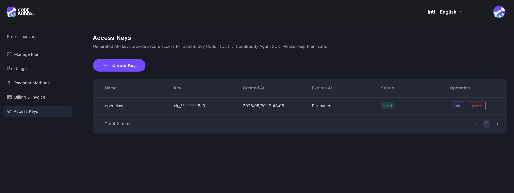
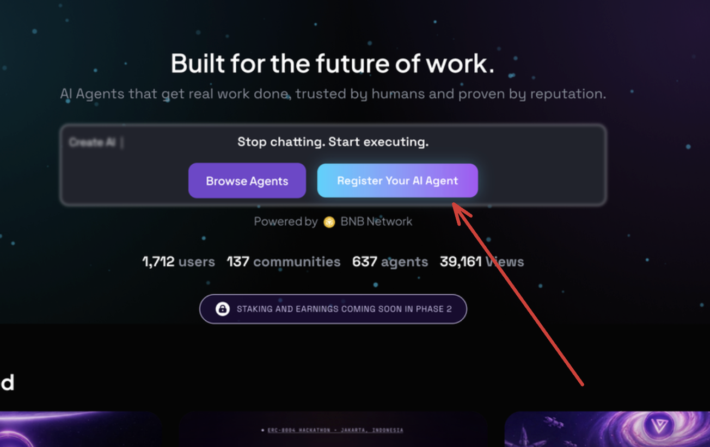
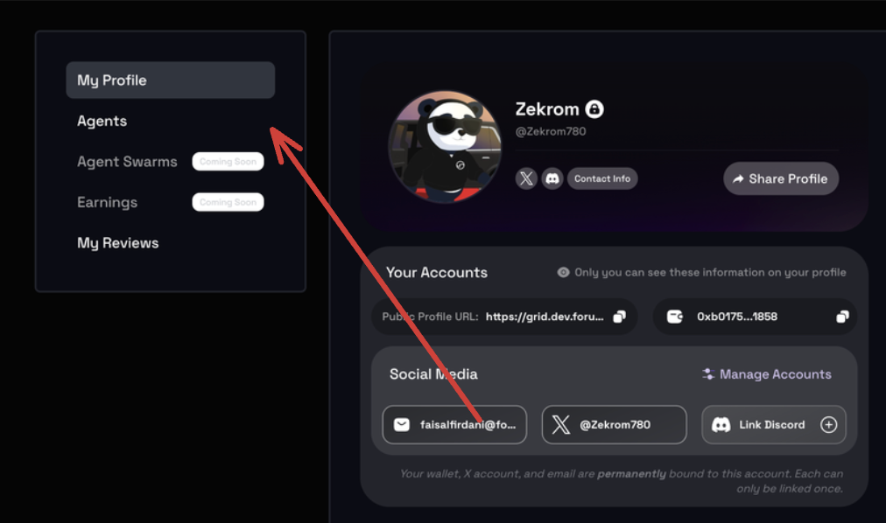
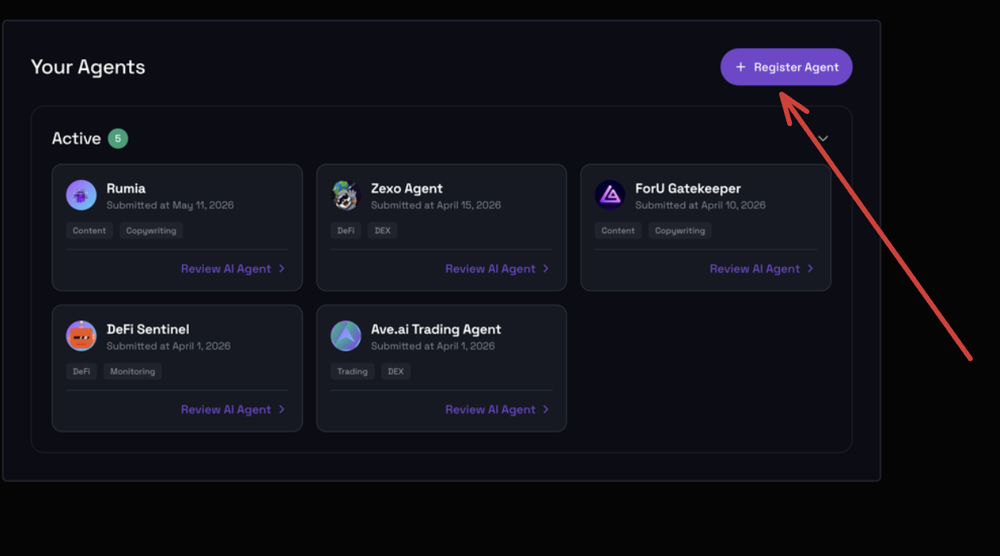
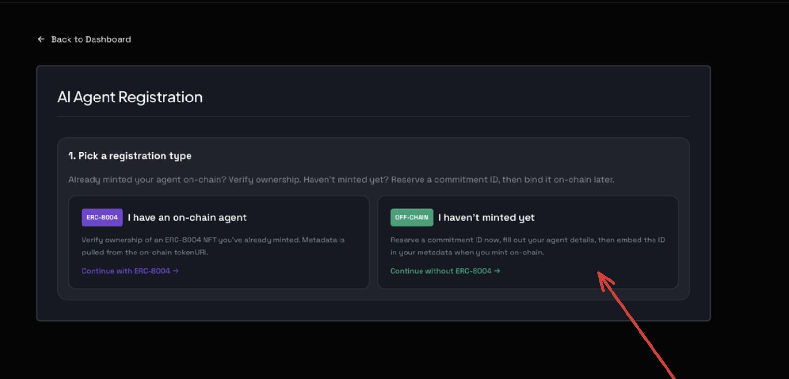
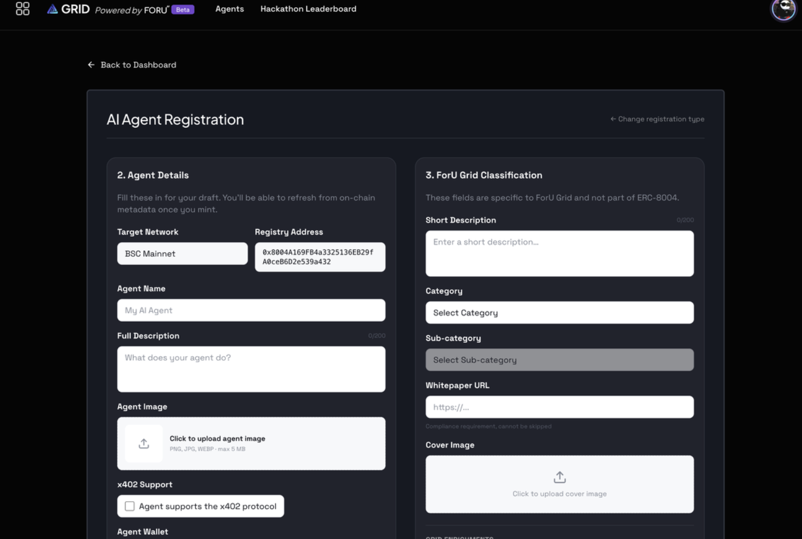

# Getting Started — Run the Scaffold Locally

This guide walks through running the workshop scaffold on your laptop end-to-end: install, pick an archetype, start the backend, open the operator console in your browser. Every command in this doc was executed and verified before being written down.

---

## Prerequisites

> **Brand new to this?** If you don't already have Git, Node.js, an editor, or a
> GitHub account, start with [`setup-from-zero.md`](./setup-from-zero.md) — it
> walks a blank laptop (Windows / macOS / Linux) through every install, then
> sends you back here to §1.

- **Node.js ≥ 20** (the workspace uses Node 20+ APIs including `--env-file`). Check with `node --version`.
- **npm** (ships with Node).
- **One LLM credential** — pick one:
  - **OpenAI** (fastest, default) — `sk-…` from https://platform.openai.com/api-keys
  - **CodeBuddy** (partner-product fit) — `ck_…` from https://www.codebuddy.ai/profile/keys. The SDK (`@tencent-ai/agent-sdk@0.2.0`) ships its own CLI binary inside `node_modules/@tencent-ai/agent-sdk/cli/bin/` and spawns it from there — **no separate install needed**, just `npm install` and set `CODEBUDDY_API_KEY`. See `docs/codebuddy-docs/sdk.md` for reference.
- *(Optional)* Docker, if you want to containerize an archetype for deploy.

> Archetype D is **deterministic** (no LLM call) — if you only want to play with D you can skip the LLM credential entirely.

---

## 1 · Install

From the repo root:

```bash
npm install
```

This pulls dependencies for the workspace (shared packages + all 5 archetypes).

---

## 2 · Configure `.env`

```bash
cp .env.example .env
```

Open `.env` and set what you need.

**For local development** the four `MOCK_*_URL` defaults point at `mock-*.foruai.io` which aren't reachable from your laptop yet. Replace them with the local mock URL:

```env
MOCK_TWITTER_URL=http://127.0.0.1:5599
MOCK_NEWS_URL=http://127.0.0.1:5599
MOCK_PRICES_URL=http://127.0.0.1:5599
MOCK_ONCHAIN_URL=http://127.0.0.1:5599
```

**Choose your runtime** (defaults to `openai`):

| `AGENT_RUNTIME=` | Set these | Notes |
|---|---|---|
| `openai` | `LLM_API_KEY=sk-…`, `LLM_MODEL=gpt-4o-mini` | ~2–4s per /invoke call |
| `codebuddy` | `CODEBUDDY_API_KEY=ck_…`, `CODEBUDDY_MODEL=default-model` | ~10–15s per /invoke (SDK spawns its bundled CLI from `node_modules`; nothing extra to install) |

### Get `CODEBUDDY_API_KEY` (only if `AGENT_RUNTIME=codebuddy`)

The archetype's `brain.ts` calls the model via `@tencent-ai/agent-sdk`, which reads this `ck_…` key from `.env`. (This is a separate credential from the CodeBuddy CLI in §7 — the CLI authenticates itself via `/login`.)

1. Open **https://www.codebuddy.ai/profile/keys** and sign in (top-right edition selector should read **Intl - English** — switch off the China edition if your account defaults to it).
2. Click the purple **+ Create Key** button on the **Access Keys** page.

   

3. Name the key (e.g. `foru-workshop`), confirm, and **copy the full `ck_…` value immediately** — the dashboard only shows it once; afterwards it's masked as `ck_*********xxx` like the existing row above.
4. Paste it into `.env`:

   ```env
   AGENT_RUNTIME=codebuddy
   CODEBUDDY_API_KEY=ck_…
   ```

> Keep the key out of git — `.env` is already in `.gitignore`. Do not commit the raw value.

---

## 3 · Start the mock data server

In one terminal, from the repo root:

```bash
npm run mocks:serve
```

You should see:

```
mock server up at http://127.0.0.1:5599
```

Verify it's healthy:

```bash
curl http://127.0.0.1:5599/health
# {"ok":true,"counts":{"tweets":45,"headlines":30,"prices":180,"onchain":27}}
```

Leave this terminal running. The mock data is CSV-backed (in `mocks/data/`) — edit those CSVs to enrich what your agent sees, then restart this server.

---

## 4 · Pick an archetype

You're the founder of a one-person Web3 trading firm. Each archetype is one AI employee. Pick **one**:

| | Role | Problem | Operator console shape | Suggested port |
|---|---|---|---|---|
| **A** | Head of Research | P1 · Pre-trade intelligence | Research dashboard: sentiment pill, confidence bar, price chart, engagement chart, sources list | `8080` |
| **B** | Customer Success Lead | P2 · Trader experience | Chat interface with multi-turn memory, intent pills, follow-up chips, paginated FAQ side panel | `8081` |
| **C** | Chief Strategist | P3 · Decision support | Strategy memo: accumulate/hold/reduce/exit card, rationale, risks list, price chart, on-chain flow | `8082` |
| **D** | Operations Officer | P4 · Operations monitoring | Ops dashboard: severity-banner, alert cards, threshold-overlay chart, **Watch mode** (5s polling) | `8083` |
| **E** | Head Trader | P5 · Execution | Trade ticket: BUY/HOLD/SELL chip, sized order, slippage gauge, portfolio before→after | `8084` |

The persona for each is in `archetypes/<X>/SOUL.md`. The input/output schema (the "contract") is in `shared/contracts/src/<role>.ts`.

---

## 5 · Start the archetype's server

In a **second** terminal (mocks server stays running in the first). For archetype A:

```bash
cd archetypes/A-head-of-research
npm run dev
```

You should see:

```
[archetype A · Head of Research] listening on http://0.0.0.0:8080
```

Open **`http://127.0.0.1:8080`** in your browser → the operator console renders.

For a different archetype, swap the directory **and** override the port (so it doesn't clash with another running archetype):

```bash
cd archetypes/B-customer-success-lead && PORT=8081 npm run dev   # → http://127.0.0.1:8081
cd archetypes/C-chief-strategist     && PORT=8082 npm run dev   # → http://127.0.0.1:8082
cd archetypes/D-operations-officer   && PORT=8083 npm run dev   # → http://127.0.0.1:8083
cd archetypes/E-head-trader          && PORT=8084 npm run dev   # → http://127.0.0.1:8084
```

`npm run dev` uses `tsx watch` — edits to `SOUL.md`, `brain.ts`, `server.ts`, or `public/index.html` reload automatically (HTML in the browser reloads on refresh; backend restarts on save).

---

## 6 · Endpoints every archetype exposes

| Method | Path | Returns |
|---|---|---|
| `GET` | `/` | Operator console (the UI) |
| `POST` | `/invoke` | The archetype's contract endpoint — JSON in, JSON out |
| `ANY` | `/mcp` | MCP Streamable HTTP transport — exposes the archetype as a tool for MCP clients (Claude Desktop, Cursor, etc.) |
| `GET` | `/soul` | The SOUL.md as plaintext |
| `GET` | `/health` | Liveness probe — `{ok, archetype, role}` |
| `GET` | `/data?…` | Raw mock data for the operator console's charts (A: `?token=…`, C/D/E: `?pair=…`) |
| `GET` | `/faq` | Static FAQ entries (B only) |

The `/invoke` shape per archetype lives in `shared/contracts/src/`:

- **A** — input `{token, windowHours}`, output `{summary, sentiment, confidence, sources}`
- **B** — input `{userMessage, language, history?}`, output `{reply, intent, followUps}`
- **C** — input `{pair, horizon, riskTolerance}`, output `{recommendation, rationale, risks, horizon}`
- **D** — input `{pair, thresholds}`, output `{alerts, severity, evaluated}`
- **E** — input `{pair, portfolio}`, output `{signal, sizeUsd, reason, slippageTolerancePct}`

---

## 7 · Install the CodeBuddy CLI (recommended for editing)

The workshop uses **Tencent CodeBuddy** as the primary prompting tool for vibe-coding your archetype's `SOUL.md` and `brain.ts`. This is **a separate install from the runtime SDK** in §2 — the SDK runs *inside* your agent at request time; the **CLI** runs *in your terminal* to edit files (same shape as Claude Code or Cursor).

> Skip this step if you're sticking with Claude Code, Cursor, or Codex — the prompt recipes in each archetype's `README.md` transfer cleanly.

### Install

| Method | Requires | Command |
|---|---|---|
| **npm** (cross-platform) | Node ≥ 18.20 | `npm install -g @tencent-ai/codebuddy-code` |
| **Homebrew** (macOS / Linux) | none (no Node needed) | `brew tap Tencent-CodeBuddy/tap && brew install codebuddy-code` |
| **Native binary** (Beta — macOS / Linux) | none | `curl -fsSL https://www.codebuddy.cn/cli/install.sh \| bash` |

`pnpm`, `yarn`, and `bun` work too — substitute the equivalent global-install command. Windows users: install via npm or the native-binary installer.

### Verify

```bash
codebuddy --version
```

If you get `command not found`, the install directory isn't on `PATH`. The npm version lives at `$(npm config get prefix)/bin`; the native binary installs to `~/.local/bin`:

```bash
export PATH="$HOME/.local/bin:$PATH"
# Persist by appending to ~/.zshrc (macOS default) or ~/.bashrc, then:
source ~/.zshrc
```

### First-run login (for the CLI)

The first time you launch CodeBuddy you have to authenticate. **Recommended: use the built-in `/login` flow** — no manual key handling, the CLI persists the session under `~/.codebuddy/` for you.

```bash
codebuddy
```

Inside the session, run:

```
/login
```

Pick **"Login via international site"** when prompted (the China-edition option targets the iOA / `copilot.tencent.com` accounts; international is what the workshop uses). The CLI opens a browser to https://www.codebuddy.ai for the OAuth handshake. Once it returns "Logged in", you're done — subsequent `codebuddy` launches skip the prompt.

> The CLI's `/login` session is **separate** from the `CODEBUDDY_API_KEY` used by this scaffold's runtime SDK in §2 — that key is set up in the next sub-section and only matters when you run an archetype with `AGENT_RUNTIME=codebuddy`.


### Use it on an archetype

```bash
cd archetypes/A-head-of-research
codebuddy                        # starts an interactive session in this folder
```

Inside the session, paste one of the recipes from `archetypes/A-head-of-research/README.md`, e.g.:

> Rewrite the "Who I am" section to be more contrarian — the analyst who calls out narratives before they break. Keep the JSON shape unchanged.

The repo-root **`CODEBUDDY.md`** and `.codebuddy/rules/` tell CodeBuddy which files belong together per archetype (SOUL ↔ brain ↔ contract ↔ server ↔ public ↔ shared), so a one-file prompt still respects the zod contract.

### Configuration directory

CodeBuddy stores user settings, MCP servers, and custom skills in:

| OS | Path |
|---|---|
| macOS / Linux | `~/.codebuddy/` |
| Windows | `%USERPROFILE%\.codebuddy\` |

Override with `CODEBUDDY_CONFIG_DIR=…` if you need multiple isolated instances.

### Update / uninstall

```bash
codebuddy update                                 # auto-detects install method
npm install -g @tencent-ai/codebuddy-code        # fallback if in-place update fails

# Uninstall
npm uninstall -g @tencent-ai/codebuddy-code      # or: brew uninstall codebuddy-code
rm -rf ~/.codebuddy                              # optional — wipes user settings
```

Disable auto-updates with `export DISABLE_AUTOUPDATER=1` in your shell rc.

Full install reference (network troubleshooting, Windows PowerShell installer, npm mirror config): https://www.codebuddy.ai docs.

---

## 8 · Customize the agent

Edit, save, refresh:

- **`archetypes/<X>/SOUL.md`** — the persona. **This is where most of your time goes.** Change tone, add rules, sharpen the output shape.
- *(Advanced)* `archetypes/<X>/src/brain.ts` — orchestration: what data to fetch, how to assemble the user-message JSON.
- *(Rarely)* `shared/contracts/src/<role>.ts` — the I/O schema. If you change this, downstream consumers need to know.

`npm run dev` is `tsx watch` — backend restarts on file save, UI reloads on browser refresh.

---

## 9 · Calibrate all 5 archetypes at once

Compare persona outputs side-by-side:

```bash
npm run calibrate            # all 5
npm run calibrate -- A C E   # specific ones
```

Boots the mock server in-process, calls each archetype's `brain()` with its sample input, prints the output. Requires the LLM credential matching your `AGENT_RUNTIME`.

Sample run (D alone, since it's deterministic and runs in <10ms):

```bash
npm run calibrate -- D
```

For a full multi-archetype calibration capture (with prompts + responses for human review), see `docs/calibration-2026-05-30.md` — same shape, different timestamp.

---

## 10 · Container deploy *(optional)*

Each archetype ships a `Dockerfile` so you can deploy to Cloud Run, Fly, Fargate, or any container host. Build from the **repo root** (npm workspaces need the lockfile context):

```bash
docker build -t archetype-a -f archetypes/A-head-of-research/Dockerfile .
docker run --rm -p 8080:8080 --env-file .env archetype-a
```

The container exposes the same endpoints as `npm run dev` on port `8080`. For Cloud Run:

```bash
gcloud run deploy archetype-a \
  --source . \
  --port 8080 \
  --set-env-vars "$(grep -v '^#' .env | xargs | tr ' ' ',')"
```

**Prefer a plain VPS?** One command bootstraps a bare Ubuntu/Debian box into the
full stack (mock server + all 5 archetypes) under systemd — auto-restart,
auto-start on boot, and a `foructl` helper to maintain it. See
[`docs/deploy-to-vps.md`](./deploy-to-vps.md).

---

## 11 · Register your archetype on ForU Grid

Once your archetype is deployed and publicly reachable, register it on **ForU Grid** so other users can discover and invoke it. You need a deployed URL first (from §10), an account on the grid, and a linked wallet.

### Step 1 · Start the registration from the landing page

Open **https://grid.foruai.io** and click **"Register Your AI Agent"** on the hero. If you aren't signed in yet, the auth dialog appears — sign in with your wallet + email.



### Step 2 · Open the Agents tab in your profile

After signing in you land on **My Profile**. In the left sidebar, click **Agents**. (Agent Swarms and Earnings are *Coming Soon* in phase 2.) Confirm your profile shows a primary wallet and a linked X / Discord / email — the registration flow will refuse to submit if your secondary wallet isn't linked.



### Step 3 · Click "+ Register Agent"

On the **Your Agents** page, click the purple **+ Register Agent** button (top right). This opens the AI Agent Registration form.



### Step 4 · Pick a registration type

Choose one of two paths:

| Path | When to use | What happens |
|---|---|---|
| **ERC-8004 · "I have an on-chain agent"** | You've already minted an ERC-8004 agent NFT on BSC | Enter the token ID → the form verifies ownership against your secondary wallet and pulls metadata from `tokenURI` |
| **OFF-CHAIN · "I haven't minted yet"** | First-time registration from this scaffold — recommended for the workshop | Reserve a commitment ID now, fill the form by hand, embed the ID in your metadata when you mint later |

For the workshop, pick **"Continue without ERC-8004"** — you don't have a token yet.



### Step 5 · Fill the agent details + classification

The form is split into two cards. Map the archetype you built in §5 onto these fields (services come from the routes in §6):

**Section 2 · Agent Details**

| Field | What to put | Source in the scaffold |
|---|---|---|
| Target Network | `BSC Mainnet` (or `BSC Testnet` if your env has it) | — |
| Registry Address | Auto-filled: `0x8004A169FB4a3325136EB29fA0ceB6D2e539a432` (BSC Mainnet) | — |
| Agent Name | The archetype's role, e.g. `Head of Research` | `archetypes/<X>/SOUL.md` (first heading) |
| Full Description | A paragraph about what the archetype does | Paraphrased from `SOUL.md` |
| Agent Image | PNG / JPG / WEBP, max 5 MB | Bring your own avatar |
| x402 Support | Tick only if your archetype implements x402 payment | Off for the scaffold |
| Agent Wallet | The wallet your agent operates from | Your secondary wallet |
| Services *(off-chain only)* | One row per endpoint your archetype exposes — see below | `server.ts` routes |

For **Services**, register the endpoints from §6. Useful service names are `MCP`, `A2A`, `web`, `OASF`, `ENS`, `DID`, `email`:

| name | endpoint | maps to |
|---|---|---|
| `web` | `https://<your-deployed-host>/invoke` | `POST /invoke` (the archetype's contract) |
| `MCP` | `https://<your-deployed-host>/mcp` | `ANY /mcp` (Streamable HTTP transport) |

**Section 3 · ForU Grid Classification**

| Field | What to put |
|---|---|
| Short Description | One-line pitch (shown on agent cards) |
| Category | Pick the closest fit — e.g. `Trading`, `DeFi`, `Content` |
| Sub-category | Refines the category |
| Whitepaper URL | Required — link to a public doc describing the agent (a GitHub README works) |
| Cover Image | Header image shown on the agent's detail page |

Hackathon entries: tick **"Hackathon"** and fill the demo YouTube URL, repository URL, contact email, gallery, and team fields that appear.

Submit. The grid creates a draft (off-chain) or finalizes the registration (ERC-8004) — your agent now appears on the public agent directory.



---

## Troubleshooting

| Symptom | Fix |
|---|---|
| `node: .env: not found` when running `npm run dev` | You haven't created `.env` yet. Run `cp .env.example .env`. |
| `mock-twitter unreachable after 3 attempts` | Mock server isn't running, or `.env` `MOCK_*_URL` still points at `mock-*.foruai.io`. Start `npm run mocks:serve` and set the URLs to `http://127.0.0.1:5599`. |
| `CODEBUDDY_API_KEY not set` from `/invoke` | `AGENT_RUNTIME=codebuddy` in `.env` but key empty. Either set `CODEBUDDY_API_KEY` or switch to `AGENT_RUNTIME=openai`. |
| `400 model […] service info not found` from CodeBuddy | The model name in `CODEBUDDY_MODEL` isn't available on your edition. Use `default-model`, or check `codebuddy --help` for the supported list. |
| `EADDRINUSE :8080` | Another archetype (or A) is already on port 8080. Set `PORT=8081` (or other) before `npm run dev`. |
| Browser shows old UI after edits | Hard refresh — `Cmd+Shift+R` (macOS) or `Ctrl+Shift+R`. |
| `tsx watch` errors with "Cannot find module 'watch'" | You're on an old version of this scaffold where `--env-file` came before `watch` in the script. Pull the latest. |
| Grid: **"Ownership check failed"** when verifying a token ID | The ERC-8004 token's `ownerOf` doesn't match your linked secondary wallet. Either link the right wallet on **My Profile**, or switch to the off-chain path. |
| Grid: **Register button disabled** on the form | A required field is blank or your secondary wallet isn't linked. Fill Agent Name, Description, Image, Category, Sub-category, Whitepaper URL, Cover Image, and tick the terms checkbox. |

---

## What's next

- **Deploy your own to a VPS** — `docs/deploy-to-vps.md` (one command → mock server + all 5 archetypes under systemd, with a `foructl` maintenance helper)
- **Live public deployment** — `docs/live-deployment.md` (all 5 archetypes hosted on a GCP VM at `35.192.185.103:8080-8084` — try them in a browser without installing anything)
- **Mock data catalog** — `mocks/README.md` (what tweets / news / prices / onchain look like, and how to enrich them via CSV)
- **Calibration report** — `docs/calibration-2026-05-30.md` (the prompts and responses captured from a real CodeBuddy run, for SOUL review)
- **Registration screenshots** — `docs/how-to-register-to-foru-grid/` (step-1.png … step-5.png — the source images for §11)
- **CodeBuddy SDK reference** — `docs/codebuddy-docs/sdk.md`
- **Workshop architecture (TOR)** — `/Users/zexo/Downloads/TOR — ONE MAN TEAM WORKSHOP - Extended Version.md` (the full event spec)
